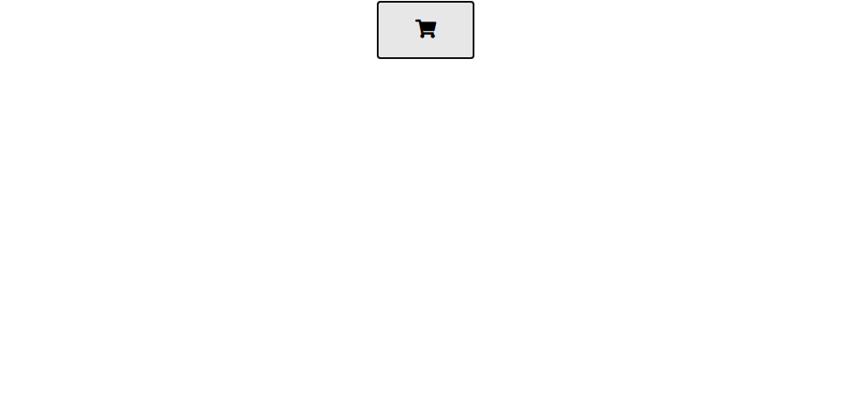
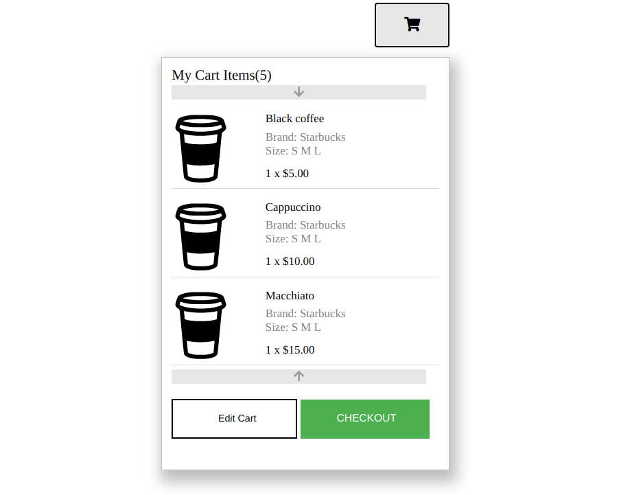

# Cart task

This app is made for frontend crash course task.
The task was based on design in figma to make a functional protopit mini-cart.
By default, only a button with a cart icon will be seen on the page, and when interacting with the icon, a mini cart should be opened.

---

## Getting started

**Technologies**

- HTML
- CSS
- JS
